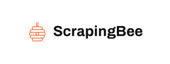
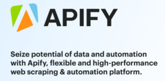
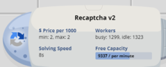
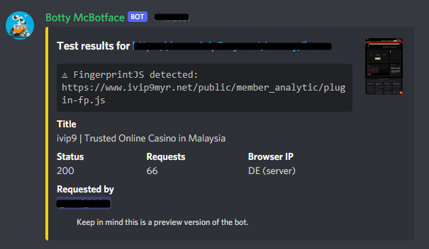

<table>
<tr>
<td width="50%" colspan=2>
This repository's development would not have been possible without the support of many partners and sponsors.
</td>
</tr>
<tr><td colspan=2></td></tr>
<tr>
<td width="50%">
    <a href="https://www.scrapingbee.com/?fpr=darius82">
        <b>ScrapingBee - Sign up for a free trial and get -10% on the first invoice with code "NIESPODD"</b> 
        
    </a>
</td>
<td width="50%">
    <a href="https://multilogin.com/antidetect/antidetect-browser/?utm_source=niespodd&utm_medium=partner&a_aid=niespodd&a_bid=f392e357">
        <b>MultiLogin - undetectable automation with built-in, quality residential proxies. Test 3 days for €1.99.</b> 
        
    </a>

</td>
</tr>
</table>

# Avoiding bot detection: How to scrape the web without getting blocked? 👨‍🔧

Whether you're just starting to build a web scraper from scratch and wondering what you're doing wrong because your solution isn't working, or you've already been working with crawlers for a while and are stuck on a page that gives you an error saying you're a bot, you can't go any further, keep reading.

Anti-bot solutions have evolved in recent years. More and more websites are introducing security measures: from simple ones, such as filtering IP addresses according to their geolocation, to advanced ones based on in-depth analysis of browser parameters and behavioral analysis. All this makes web scraping content more difficult and costly than a few years ago. Nevertheless, it is still possible. Here I highlight a few tips that you may find helpful.

## Where to begin building undetectable bot?

Below you can find list of curated services that I used to get around different anti-bot protections. Depending on your use-case you may need one of the following:

<table>
<thead>
<tr>
<th>Scenario/use-case</th>
<th>Solution</th>
<th>Example</th>
</tr>
</thead>
<tbody>
<tr>
<td><b>Short-lived sessions without auth</b></td>
<td>Pool of rotating IP addresses</td>
<td>That comes handy when you scrape websites like Amazon, Walmart or public LinkedIn pages. That is any website where no sign-in is required. You plan to make a high number of short-lived sessions and can afford being blocked every now and then.</td>
</tr>
<tr>
<td><b>Geographically restricted websites</b></td>
<td>Region-specific pool of IP addresses</td>
<td>This is useful when the website uses a firewall similar to <a href="https://community.cloudflare.com/t/blocking-entire-countries/24172/8">the one from Cloudflare to block entire geography</a> from accessing it.</td>
</tr>
<tr>
<td><b>Long-lived sessions after sign-in</b></td>
<td>Repeatable pool of IP addresses and stable set of browser fingerprints</td>
<td>The most common scenario here is social media automation e.g. you build a tool to automate social media accounts to manage ads more efficiently.</td>
</tr>
<tr>
<td><b>Javascript-based detection</b></td>
<td>Use of popular evasion libraries, similar to <a href="https://github.com/berstend/puppeteer-extra/tree/master/packages/puppeteer-extra-plugin-stealth">puppeteer-extra-plugin-stealth</a></td>
<td>There is a number of websites utilizing <a href="https://fingerprintjs.com/">FingerprintJS</a> that can be easily bypassed when you employ open-source plugins such as the aforementioned puppeteer stealth plugin to work with your existing software.</td>
</tr>
<tr>
<td><b>Detection with browser fingerprinting techniques</b></td>
<td>Natural looking browser fingerprints. That is, having covered the whole surface that is being validated by the installed Javascript solution on the target website.</td>
<td>These are one of the most advanced cases. Mainstream examples are credit card processors such as Adyen or Stripe. A very sophisticated browser fingerprint is being created to detect credit fraud, or prompt additional authorization from the user.</td>
</tr>
<tr>
<td><b>Unique set of detection techniques</b></td>
<td>Specialized bot software that targets the unique detection surface of the target website.</td>
<td>Good examples are <a href="https://www.businessinsider.com/sneaker-bots-how-to-buy-make-and-run-the-tech-2021-1">sneakers marketplace websites and e-commerce shops, reportedly being under heavy attack from custom made bot software</a>.</td>
</tr>
<tr>
<td><b>Simple custom-made detection techniques</b></td>
<td>Before diving into any of the above, if you are targeting a smaller website, it is very likely that all you need is a <a href="https://www.zyte.com/blog/how-to-scrape-the-web-without-getting-blocked/">Scrapy script with tweaks</a>, a cheap data-center proxy, and you are good to go.</td>
<td>-</td>
</tr>
</tbody>
</table>

Once you have decided on what type of evasion is going to be needed in your project, you can use the list below to pick the best provider for your project:

### Helpful services

<table>
<thead>
<tr>
<th>Type</th>
<th width=50%>Service</th>
<th>Note</th>
</tr>
</thead>
<tbody>
<tr>
<td rowspan=2><b>Proxy</b></td>
<td>
    <b>BrightData (formerly Luminati Networks)</b> 
    
</td>
<td>
    One of the most popular, but probably as well the most expensive, proxy provider. The IP pool is mainly sourced from users of HolaVPN and an app monetization SDK. 
</td>
</tr>

<tr>
<td>
    <b>Oxylabs</b> 
    
</td>
<td>
    Competitor to BrightData with more no-code/low-code scraping products.
</td>
</tr>

<tr>
<td rowspan=2>
    <b>Scraping as a service</b>
</td>
<td>
    <a href="https://cutt.ly/VRkHvnL">
        <b>ScrapingBee</b> 
        
    </a>
</td>
<td>
    <u><strong>Highly recommended 👍</strong></u> 
    One of the most advanced stealthy scraping as a service. At times it may be cheaper than building a dedicated scraping solution - they do not charge for the amount of traffic used.
</td>
</tr>
    
<tr>
<td>
    <a href="https://cutt.ly/8RkGETc">
        <b>Apify.com</b> 
        
    </a>
</td>
<td>
    Apify has evolved into a complete scraping and automation SaaS platform, with ready-made tools, an integrated proxy, and custom solutions for scraping at any scale. Developers can also create scrapers on the platform and rent them to other users.
</td>
</tr>

<tr>
<td>
    <b>De-captcha as a service</b>
</td>
<td>
    <a href="https://cutt.ly/NRkGtmo">
        <b>Anti Captcha: Captcha Solving Service. Bypass reCAPTCHA, FunCaptcha (...)</b> 
        
    </a>
</td>
<td>
    Self-explanatory. Bitcoin accepted ❤️.
</td>
</tr>

</tbody>
</table>

## List of anti-bot software providers

This is a non-exhaustive list of companies that provide the most advanced anti-bot solutions for businesses ranging from smaller e-commerce sites to Fortune 500 companies:

- [Akamai Bot Manager by Akamai](https://www.akamai.com/uk/en/products/security/bot-manager.jsp)
- [Advanced Bot Protection by Imperva](https://www.imperva.com/products/advanced-bot-protection-management/) (former Distil Networks)
- [DataDome Bot Protection](https://datadome.co/bot-protection/)
- [PerimeterX](https://www.perimeterx.com/) (acquired by HUMAN)
- [Shape Security](https://www.shapesecurity.com/) (acquired by F5)
- [Cloudflare Bot Management](https://www.cloudflare.com/en-gb/products/bot-management/)
- [Barracuda Advanced Bot Protection](https://www.barracuda.com/products/advanced-bot-protection)
- [HUMAN](https://www.humansecurity.com/products/platform)
- [Kasada](https://www.kasada.io/)
- [Alibaba Cloud Anti-Bot Service](https://www.alibabacloud.com/products/antibot)
- [Travatar](https://travatar.ai/)
- [Ocule](https://ocule.io/)
- [Sift](https://siftscience.com)
- [Forter](https://www.forter.com/)
- [Reblaze](https://www.reblaze.com/)
- [Arkose Labs](https://www.arkoselabs.com/)
- [LexisNexis® ThreatMetrix®](https://risk.lexisnexis.com/products/threatmetrix)

### How do you know who is getting you blocked?

Join [extra.community](https://extra.community/). There runs an automated tester **Botty McBotface** that uses several complicated techniques to determine what exact protection a tested website uses (credits to [berstend](https://github.com/berstend) and others from #insiders).

### Available stealth browsers with automation features

**Important** You use this software at your own risk. Some of them contain malwares just fyi. **Use with caution.**

<table>
<thead>
<tr>
<th>Stealth Browser</th>
<th>Puppeteer</th>
<th>Selenium</th>
<th>Evasions</th>
<th>SDK/Tooling</th>
<th>Origin</th>
</tr>
</thead>
<tbody>
<tr>
<td><a href="https://gologinapp.com">GoLogin</a></td>
<td>✔️</td>
<td>✔️</td>
<td>🤮</td>
<td>👍</td>
<td>🇺🇸 + 🇷🇺</td>
</tr>
<tr>
<td><a href="https://incogniton.com">Incogniton</a></td>
<td>✔️</td>
<td>✔️</td>
<td>🤮</td>
<td>✔️</td>
<td>🇳🇱 ❓</td>
</tr>
<tr>
<td><a href="https://www.clonbrowser.com/">ClonBrowser</a></td>
<td>✔️</td>
<td>✔️</td>
<td>🤮</td>
<td>✔️</td>
<td>🇸🇬</td>
</tr>
<tr>
<td><a href="https://multilogin.com">MultiLogin</a></td>
<td>✔️</td>
<td>✔️</td>
<td>🤮</td>
<td>✔️</td>
<td>🇪🇪 + 🇷🇺</td>
</tr>
<tr>
<td><a href="https://indigobrowser.com">Indigo Browser</a></td>
<td>✔️</td>
<td>✔️</td>
<td>🤮</td>
<td>✔️</td>
<td>🇪🇪</td>
</tr>
<tr>
<td><a href="https://ghostbrowser.com">GhostBrowser</a></td>
<td>❌</td>
<td>❌</td>
<td>❌</td>
<td>👍</td>
<td>🇺🇸</td>
</tr>
<tr>
<td><a href="https://kameleo.io/?ref=10697">Kameleo</a></td>
<td>✔️</td>
<td>✔️</td>
<td>🤮</td>
<td>✔️</td>
<td>🇭🇺</td>
</tr>
<tr>
<td><a href="https://antbrowser.pro">AntBrowser</a></td>
<td>❌</td>
<td>❌</td>
<td>❌</td>
<td>❌</td>
<td>🇷🇺</td>
</tr>
<tr>
<td><a href="https://v03.chebrowser.site/">CheBrowser</a></td>
<td>❌</td>
<td>❌</td>
<td>🤮/✔️</td>
<td>👍</td>
<td>🇷🇺</td>
</tr>
</tbody>
</table>

**Legend:** 🤮 - Evasion based on noise. ❌ - No. ✔️ - Acceptable (with support libraries or not). 👍 - Very nice.

---

A ⭐ on this repo will be **appreciated**!

---

# Technical insights into bypassing bot detection

Here I study various aspects of evasion techniques used to get around bot detection systems used by major online websites. I cover both technical and non-technical matters, including recommendations, references to scientific papers and more.

The technical findings that I am sharing below are based on observations of running web scraping scripts for a few months against websites protected by [the major anti-bot solution vendors](#list-of-anti-bot-firewall-vendors).

_I constantly add stuff to this section. Over time I will try to make it look&feel more structured._

## Random, maybe useful

- [Cap FPS for Chromium with software rendering --use-gl=swiftshader](https://gist.github.com/niespodd/c7fd14e0e58652e74c0f1fdbd819112d) - Limit CPU usage from SwiftShader by redraw freq. of Chromium in AVD
- Unlike some public comments on that matter **chrome devtools protocol actually works** on AVD-s with puppeteer
- [Abusing GPU cache to create persistent tracking identifiers](https://niespodd.github.io/persistent-tracking-shader-cache/)
- [Data WhiteOps (now HUMAN) collects (2020)](https://smitop.com/post/whiteops-data/)

## [puppeteer-extra-plugin-stealth 😈](https://github.com/berstend/puppeteer-extra/tree/master/packages/puppeteer-extra-plugin-stealth)

✔️ Win / ❌ Fail / 🤷 Tie :

- ✔️ **Client Hints** - [Shipped recently](https://github.com/berstend/puppeteer-extra/pull/413). In line with Chromium cpp implementation.
- ✔️ **General `navigator` and `window` properties**
- ✔️ **Chrome plugins and native extensions** - This includes both Widevine DRM extension, as well as Google Hangouts, safe-browsing etc.
- [🤷 p0f - detect host OS from TCP struct](https://en.wikipedia.org/wiki/P0f) - Not possible to fix via Puppeteer APIs. Used in [Akamai Bot Manager](https://www.akamai.com/uk/en/products/security/bot-manager.jsp) to match against JS and browser headers (Client Hints and `User-Agent`). There is a [detailed explaination of the issue](https://nmap.org/misc/defeat-nmap-osdetect.html). The most reliable evasion seems to be not spoofing host OS at all, or using [OSfooler-ng](https://github.com/segofensiva/OSfooler-ng).
- 🤷 **Browser dimensions** - Although [stealth plugin provides `window.outerdimensions` evasion](https://github.com/berstend/puppeteer-extra/blob/master/packages/puppeteer-extra-plugin-stealth/evasions/window.outerdimensions/index.js#L25), it won't work without correct config on non-default OS in headless mode; almost always fails when `viewport size >= screen resolution` (low screen resolution display on the host).
- [❌ core-estimator](https://github.com/oftn-oswg/core-estimator/blob/master/core-estimator.js) - This can detect mismatch between navigator.hardwareConcurrency and SW/WW execution profile. Not possible to limit/bump the `ServiceWorker`/`WebWorker` thread limit via existng Puppeteer APIs.
- ❌ **WebGL extensions profiling** - desc. tbd
- ❌ **RTCPeerConnection when behind a proxy** - Applies to both SOCKS and HTTP(S) proxies.
- ❌ **Performance.now** - desc. tbd (red pill)
- ❌ **WebGL profiling** - desc. tbd
- ❌ **Behavior Detection** - desc. tbd (events, params, ML+AI buzz)
- ❌ **Font fingerprinting** - desc. tbd (list+version+renderer via HTML&canvas)
- ❌ **Network Latency** - desc. tbd (integrity check: proxy det., JS networkinfo, dns resolv profiling&timing)
- ❌ **Battery API** - desc. tbd
- ❌ **Gyroscope and other (mostly mobile) device sensors** - desc. tbd

## Stealth alternatives 🩹

Where `puppeteer-extra-plugin-stealth` falls short, there are attempts to go deeper and patch at lower levels. `Runtime.Enable` events, `navigator.webdriver`, and other attributes can't be reliably masked for JS in JS (`Object.defineProperty`). Below are some projects patching at either the automation library level, the CDP transport, or the browser binary itself:

<table>
<thead>
<tr>
<th>Repo</th>
<th>Updated</th>
<th></th>
</tr>
</thead>
<tbody>
<tr>
<td><a href="https://github.com/ultrafunkamsterdam/nodriver">nodriver</a></td>
<td></td>
<td>Successor to undetected-chromedriver. Skips Selenium/Chromedriver and drives Chrome over CDP directly, so the WebDriver-flavored leaks are gone.</td>
</tr>
<tr>
<td><a href="https://github.com/rebrowser/rebrowser-patches">rebrowser-patches</a></td>
<td></td>
<td>Drop-in patches for Puppeteer/Playwright that fix the <code>Runtime.Enable</code> leak and other CDP giveaways most stealth plugins still miss.</td>
</tr>
<tr>
<td><a href="https://github.com/Kaliiiiiiiiii-Vinyzu/patchright">patchright</a></td>
<td></td>
<td>Patched Playwright fork in the same spirit as rebrowser-patches.</td>
</tr>
<tr>
<td><a href="https://github.com/daijro/camoufox">camoufox</a></td>
<td></td>
<td>Custom Firefox build with fingerprinting tweaks at the C++ level — refreshing change from JS-layer monkey patching.</td>
</tr>
<tr>
<td><a href="https://github.com/feder-cr/invisible_playwright">invisible-playwright</a></td>
<td></td>
<td>Patched Firefox driven through the standard Playwright API. Fingerprint is set in the C++ source and derived from a seed, so one seed reproduces one machine across runs.</td>
</tr>
<tr>
<td><a href="https://github.com/berstend/puppeteer-extra/tree/master/packages/playwright-extra">playwright-extra</a></td>
<td></td>
<td>Same plugin pipeline as puppeteer-extra, but for Playwright.</td>
</tr>
</tbody>
</table>

## [Multilogin](https://multilogin.com), [Kameleo](https://kameleo.io/?ref=10697) and others 💰🤠

- ❌ **General `navigator` and `window` properties** - As per [Multilogin documentation](https://docs.multilogin.com/l/en/article/chvo34br5c-global-browser-profile-preferences) custom browser builds typically lag behind the latest additions added by browser vendors. In this case modified Chromium M7X is used (almost 10 versions behind when writing this).
- 🤷 **Font masking** - Font fingerprinting still leaks host OS due to use of [different font rendering backends on Win/Lin/Mac](https://blog.typekit.com/2010/10/15/type-rendering-operating-systems/). However, the basic "font whitelisting" technique can help to slightly rotate browser fingerprint.
- ❌ **Inconsistencies** - Profile misconfiguration leads to early property/behavior inconsitency detection.
- ❌ **Native extensions** - Unlike `puppeteer-extra-plugin-stealth` custom Chromium builds such as ML and Kameleo provide at most an override for native plugins and extensions shipped with Google Chrome.
- ❌ **AudioContext APIs and WebGL property override** - Manipulation of original canvas and audio waveform can be detected with custom JS.
- ✔️ **Audio and GL noise**

tbd (if you have an active subscription in any of these services and don't mind sharing an account drop me an email ❤️)

### Fingerprint test pages

These websites may be useful to test fingerprinting techniques against a web scraping software

<table>
<thead>
<tr>
<th>Test page</th>
<th>Notes</th>
</tr>
</thead>
<tbody>
<tr><td><a href="https://bot.incolumitas.com/">https://bot.incolumitas.com/</a></td><td>Very helpful and useful collection of tests</td></tr>
<tr><td><a href="https://plaperdr.github.io/morellian-canvas/Prototype/webpage/picassauth.html">https://plaperdr.github.io/morellian-canvas/Prototype/webpage/picassauth.html</a></td><td>canvas fingerprinting on steroids</td></tr>
<tr><td><a href="https://pixelscan.net/">https://pixelscan.net/</a></td><td>Not 100% realiable as it often displays "inconsistent" to Chrome after a new update, but worth checking as the author adds new interesting detection features every now and then</td></tr>
<tr><td><a href="https://browserleaks.com/">https://browserleaks.com/</a></td><td>Doesn't need introduction 😉</td></tr>
<tr><td><a href="https://f.vision/">https://f.vision/</a></td><td>Good quality test page from some 🇷🇺 guys</td></tr>
<tr><td><a href="https://www.ipqualityscore.com/ip-reputation-check">https://www.ipqualityscore.com/ip-reputation-check</a></td><td>Commercial service with free reputation check against popular blacklists</td></tr>
<tr><td><a href="https://antcpt.com/eng/information/demo-form/recaptcha-3-test-score.html">https://antcpt.com/eng/information/demo-form/recaptcha-3-test-score.html</a></td><td>ReCaptcha score as well as some interesting notes on how to optimize captcha solving costs</td></tr>
<tr><td><a href="https://ja3er.com/">https://ja3er.com/</a></td><td>💀 dead since ~2022 — SSL/TLS fingerprint, kept here for historical reference</td></tr>
<tr><td><a href="https://tls.peet.ws/">https://tls.peet.ws/</a></td><td>TLS fingerprint (JA3, JA4, HTTP2 frames, Akamai fingerprint) — pretty much replacement for ja3er</td></tr>
<tr><td><a href="https://fingerprintjs.com/demo/">https://fingerprintjs.com/demo/</a></td><td>Good for basic tests - from people who believe and claim can create unique fingerprints "99.5%" of the time</td></tr>
<tr><td><a href="https://coveryourtracks.eff.org/">https://coveryourtracks.eff.org/</a></td><td>-</td></tr>
<tr><td><a href="https://www.deviceinfo.me/">https://www.deviceinfo.me/</a></td><td>-</td></tr>
<tr><td><a href="https://amiunique.org/">https://amiunique.org/</a></td><td>-</td></tr>
<tr><td><a href="http://uniquemachine.org/">http://uniquemachine.org/</a></td><td>-</td></tr>
<tr><td><a href="http://dnscookie.com/">http://dnscookie.com/</a></td><td>-</td></tr>
<tr><td><a href="https://whatleaks.com/">https://whatleaks.com/</a></td><td>-</td></tr>
<tr><td><a href="https://antcpt.com/eng/information/demo-form/recaptcha-3-test-score.html">https://antcpt.com/eng/information/demo-form/recaptcha-3-test-score.html</a></td><td>Check your reCaptcha score</td></tr>
<tr><td><a href="https://antoinevastel.com/bots/">https://antoinevastel.com/bots/</a></td><td>-</td></tr>
<tr><td><a href="https://antoinevastel.com/bots/datadome">https://antoinevastel.com/bots/datadome</a></td><td>-</td></tr>
<tr><td><a href="https://iphey.com/">https://iphey.com/</a></td><td>-</td></tr>
<tr><td><a href="https://bot.sannysoft.com/">https://bot.sannysoft.com/</a></td><td>-</td></tr>
<tr><td><a href="https://webbrowsertools.com/canvas-fingerprint/">https://webbrowsertools.com/canvas-fingerprint/</a></td><td>-</td></tr>
<tr><td><a href="https://webbrowsertools.com/webgl-fingerprint/">https://webbrowsertools.com/webgl-fingerprint/</a></td><td>-</td></tr>
<tr><td><a href="https://fingerprint.com/products/bot-detection/">https://fingerprint.com/products/bot-detection/</a></td><td>-</td></tr>
<tr><td><a href="https://abrahamjuliot.github.io/creepjs/">https://abrahamjuliot.github.io/creepjs/</a></td><td>Really creepy, the strongest of all</td></tr>
<tr><td><a href="https://fingerprint-scan.com/browser_extensions">https://fingerprint-scan.com/browser_extensions</a></td><td>Probes installed browser extensions against a database of known web-accessible extension resources</td></tr>
</tbody>
</table>

# Non-technical notes

I need to make a general remark to people who are evaluating (and/or) planning to introduce anti-bot software on their websites. **Anti-bot software is nonsense.** Its snake oil sold to people without technical knowledge for heavy bucks.

Blocking bot traffic is based on the premise that you (or your technology provider) can **distinguish bots from real users**. To make this happen various privacy-invasive techniques are applied. To date none of them has been proved to be successful against specialized web scraping tools. **Anti-bot software is all about reducing cheap bot traffic.** It makes the process of scraping more expensive and complicated, but **does not make it entirely impossible**.

Anti-bot software vendors use detection techniques that fall into one of these two categories:

### Binary detection

No specialized web scraping software is used. Vendor can detect the bad traffic based on information openly disclosed by the scraper e.g. `User-Agent` header, connection parameters etc.

As a result **only bots that are not targeted to scrape specific website are blocked**. This will make most of the managers happy, because the overall number of _bad traffic_ goes down and it may almost look like there is no more bot traffic on the website. **Wrong.**

### Traffic clustering

More advanced web scrapers make use of residential proxies and implement complex evasion techniques to fool anti-bot software to think that the web scraper is a real user. No detection mechanism exists to get around this due to technical limitation of web browsers.

In this case, most of the time the vendor will be only able to **cluster the bad traffic** by finding patterns in bot traffic and behavior. This is where browser fingerprinting comes into play. The problem with banning the traffic here is that it may turn out to be a risky operation when bots are successfully mimicking real users. There is a chance that **by blocking bots the website will become unavailable to real visitors**.

### _Gateways, captchas & co_

If you think this is a way to go [google "captcha resolve api"](https://letmegooglethat.com/?q=captcha+resolve+api).

## Support

If you have problems with scraping specific website, write me a short email at `dniespodziany@gmail.com` — happy to chat 😊.

Have I mentioned a ⭐ would be appreciated? :-)

➡️ Ethereum address `0x380a4b41fB5e0e1EB8c616eBD56f62f8F934Bab6`
